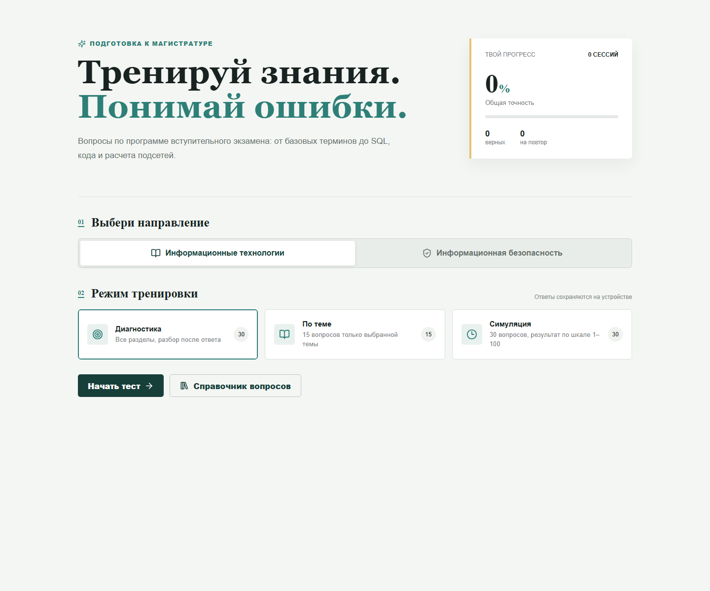
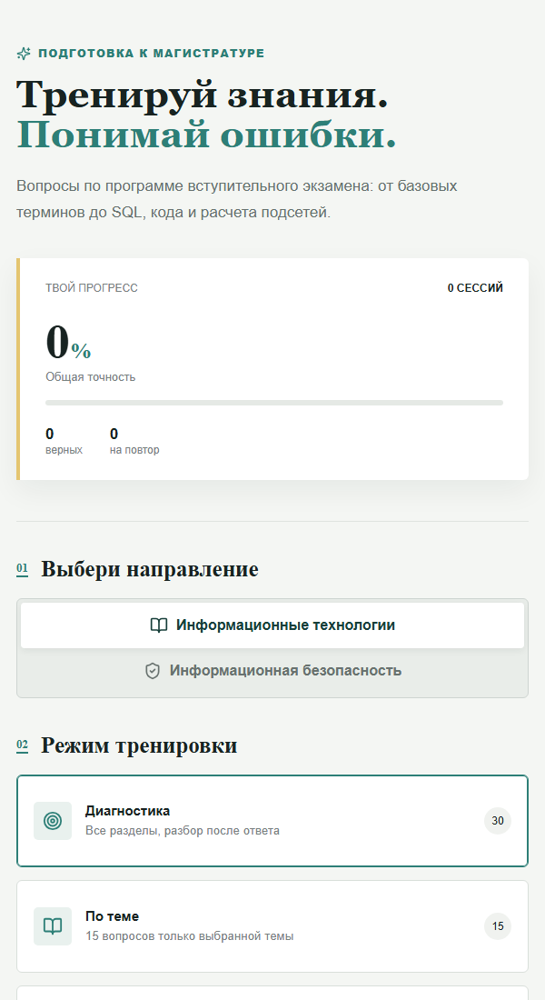

<div align="center">

# LearnIT Tests

### Подготовка к вступительному экзамену в магистратуру

[](https://vuejs.org/)
[](https://vite.dev/)
[](./src/questions.js)
[](#возможности)

Тренажер по программе вступительного экзамена для направлений  
**«Информационные технологии»** и **«Информационная безопасность»**.

</div>



## Возможности

- **Диагностика** — 30 вопросов по всем разделам с разбором каждого ответа.
- **Тематический тест** — 15 вопросов исключительно по выбранной теме.
- **Симуляция экзамена** — 30 вопросов без подсказок и оценка по шкале от 1 до 100.
- **Работа над ошибками** — вопрос считается усвоенным после двух успешных повторов.
- **Справочник** — все вопросы с поиском, фильтрами, ответами и объяснениями.
- **Избранное** — вопросы можно отметить звездочкой и пройти отдельным тестом; список синхронизируется между устройствами.
- **Установка на iPhone** — приложение добавляется на экран «Домой» из меню «Поделиться» в Safari.
- **Офлайн-режим** — установленное приложение открывается без сети, а завершенные результаты ждут подключения и затем синхронизируются.
- **История прохождений** — результаты и незавершенный тест сохраняются в браузере.
- **Аккаунты Supabase** — история, прогресс и ошибки синхронизируются между устройствами.
- **Общая таблица лидеров** — рейтинг по среднему баллу всех симуляций.
- **Два направления** — отдельное распределение тем для ИТ и ИБ.

## Темы

| Раздел | Что проверяется |
|---|---|
| Алгоритмы и программирование | Алгоритмы, сортировки, сложность, C/C++/Python/JavaScript, ООП, SOLID |
| Базы данных и SQL | SELECT, условия, агрегаты, JOIN, подзапросы, транзакции, DDL/DML/DQL/DCL/TCL |
| Компьютерные сети | OSI, TCP/IP, IPv4/IPv6, маски, CIDR, порты, IEEE 802 |
| Моделирование систем | Виды моделей, устойчивость, сходимость, методы Ньютона и Эйлера, Лаплас |
| Компьютерная графика | Растр и вектор, форматы, RGB/CMYK, Photoshop, CorelDRAW |
| Электронная информация | Единицы информации, кодировки, типы данных, форматы, API |
| Информационная безопасность | CIA, доступ, MFA, криптография, вредоносное ПО, веб-угрозы |

### Практический SQL

Блок баз данных построен с учетом акцента консультации: большинство SQL-заданий содержит небольшую таблицу и запрос, результат которого нужно определить. Есть и обратные задачи — выбрать запрос по заданному условию.

```sql
SELECT department, SUM(amount) AS total
FROM payments
GROUP BY department
HAVING SUM(amount) > 100;
```

В банке представлены `WHERE`, `LIKE`, `BETWEEN`, `NULL`, агрегаты, `GROUP BY`, `HAVING`, `INNER/LEFT JOIN`, подзапросы, а также последствия `UPDATE` и `DELETE` без `WHERE`.

## Адаптивный интерфейс

Приложение адаптировано для подготовки с компьютера, планшета или телефона, а прогресс синхронизируется через Supabase.

<div align="center">
  
</div>

## Быстрый старт

Требуется [Node.js](https://nodejs.org/) версии 18 или новее.

```bash
git clone https://github.com/chikbob/learn-it-tests.git
cd learn-it-tests
npm install
npm run dev
```

После запуска приложение будет доступно по адресу `http://localhost:5173`.

Production-сборка:

```bash
npm run build
npm run preview
```

## Настройка Supabase

Проект использует Supabase Auth и PostgreSQL для синхронизации между устройствами.

1. Откройте **SQL Editor** в Supabase и выполните [`supabase/schema.sql`](./supabase/schema.sql).
2. В **Authentication → URL Configuration** задайте Site URL приложения.
3. Добавьте локальный и production-адреса в Redirect URLs, например `http://localhost:5173/**` и `https://learn-it-tests.vercel.app/**`.
4. Оставьте **Confirm email** включенным — после регистрации пользователь подтверждает адрес по ссылке из письма.

Шаблон письма находится в [`supabase/email-confirmation.html`](./supabase/email-confirmation.html). Вставьте его в **Authentication → Emails → Templates → Confirm signup**, а в поле Subject укажите `Подтвердите регистрацию в LearnIT Tests`. Ссылка подтверждения возвращается на домен приложения, чтобы пользователю не требовался прямой доступ к `supabase.co`.

Для смены пароля вставьте [`supabase/password-recovery.html`](./supabase/password-recovery.html) в **Authentication → Emails → Templates → Reset password**, а в Subject укажите `Смена пароля в LearnIT Tests`. Пользователь сможет задать новый пароль только после перехода по ссылке из письма.

## Структура проекта

```text
src/
├── components/
│   ├── HomeScreen.vue       # выбор направления и режима
│   ├── QuestionCatalog.vue  # справочник всех вопросов
│   ├── AuthScreen.vue        # регистрация и вход через Supabase
│   ├── LeaderboardScreen.vue # общая таблица лидеров
│   ├── QuizScreen.vue       # прохождение теста
│   └── ResultsScreen.vue    # баллы и разбор ошибок
├── composables/
│   ├── useAuth.js           # авторизация и загрузка рейтинга
│   └── useExam.js           # логика тестов и синхронизация прогресса
├── lib/supabase.js          # клиент Supabase
├── App.vue                  # переключение экранов
├── additionalQuestions.js  # дополнительные вопросы по пробелам программы
├── questions.js             # основной банк вопросов
└── style.css                # общие стили
```

## Как рассчитывается результат

В симуляции все 30 вопросов равнозначны:

```text
балл = round(правильные ответы / 30 × 100)
```

Минимальный отображаемый результат — 1 балл, максимальный — 100. Помимо общего балла приложение показывает точность по каждому разделу и формирует персональный список ошибок.

## Основа банка вопросов

Темы, веса разделов и правила составления вопросов взяты из [чек-листа вступительного экзамена](./checklist_vstupitelny_ekzamen_it_ib.md). Вопросы имеют четыре варианта ответа, один лучший правильный вариант и краткое объяснение.

---

<div align="center">
  <b>LearnIT Tests</b> — практика, разбор и повторение в одном тренажере.
</div>
